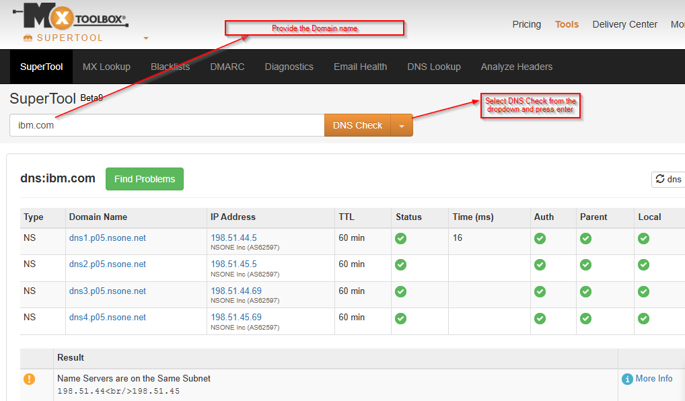

# OSINT: DNS Enumeration Using MXToolbox
##  Overview
This project demonstrates a basic **Open-Source Intelligence (OSINT)** technique known as **DNS enumeration**. By querying publicly available DNS records, valuable information is gathered about an organization’s infrastructure without actively interacting with its systems.

This type of reconnaissance is commonly used during the early stages of security assessments.

---
## Objective
To investigate the domain **ibm.com** to identify:
- Public IP addresses associated with the domain
- Mail servers responsible for handling email (MX records)

---

##  Tool Used  
- MXToolbox SuperTool -Online DNS and email diagnostic platform

---

## Process
#### Step 1: Access MXToolbox
Navigate to the MXToolbox SuperTool website.
#### Step 2: Enter the Target Domain
In the search box, enter the domain:
#### Step 3: Select DNS Check then run the test.
From the dropdown menu,select DNS Check

---

---

## Findings

A Records (IP Addresses) Displays public IP addresses associated with `ibm.com`
Indicates where the domain is hosted

---

 **MX Records (Mail Exchange)**
- Identifies mail servers responsible for handling email
- Includes priority values and server hostnames

---

##  Reflection/Learning
DNS (Domain Name System) records store publicly accessible information about a domain, including:
- A Records which  maps domain names to IP addresses
- MX Records which defines mail servers responsible for email delivery
- NS Records which specify authoritative name servers
- These records are analysed to understand an organization’s digital footprint
- DNS enumeration is legal, ethical, and widely used in cybersecurity

 ## Disclaimer
This write-up is for educational purposes only. All information was obtained using passive, publicly available sources. No systems were scanned, exploited, or interacted with beyond standard DNS queries.

